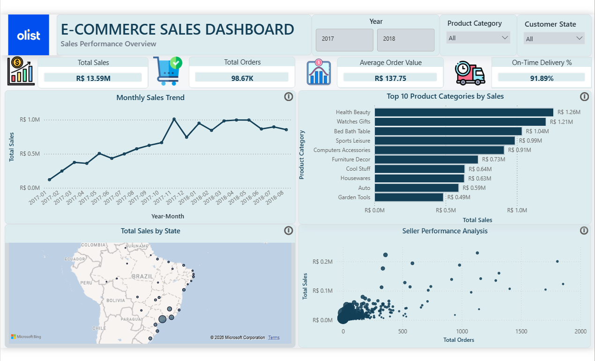
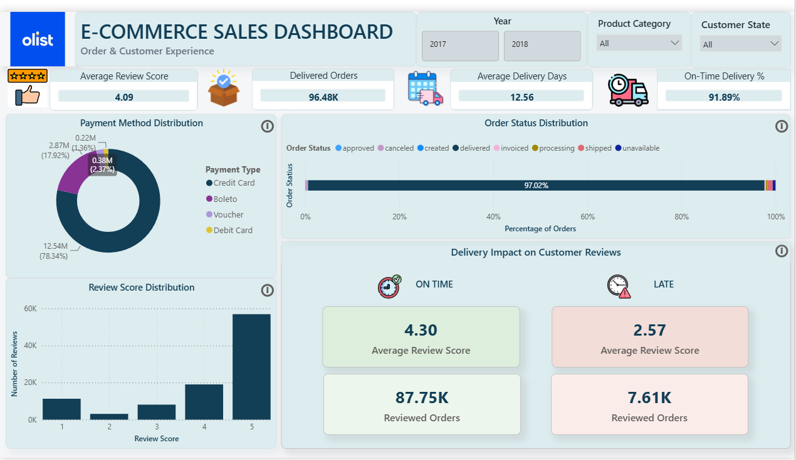
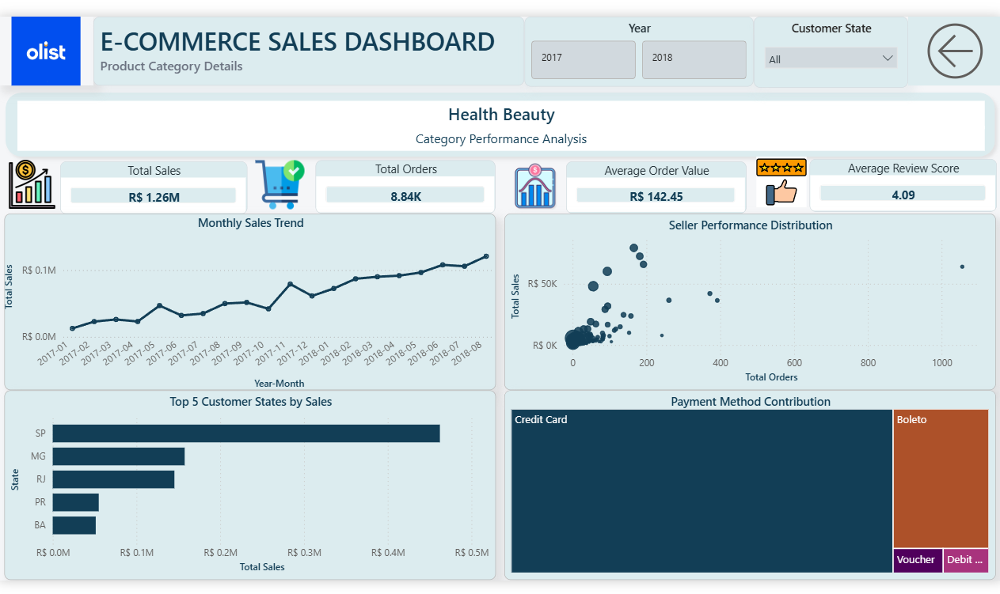

# 🛒 Olist E-Commerce Sales Analysis | SQL & Power BI

## 📌 Project Overview

This project analyzes the **Brazilian E-Commerce Public Dataset by Olist** to explore sales performance, product category trends, seller performance, geographic sales distribution, payment behavior, order fulfillment, delivery performance, and customer satisfaction.

The project combines **MySQL** for database creation, data validation, cleaning, and business analysis with **Power BI** for data modeling, DAX calculations, interactive visualization, and dashboard development.

The final Power BI report consists of three pages:

1. **Sales Performance Overview**
2. **Order & Customer Experience**
3. **Product Category Details — Drill-through Analysis**

---

## 🎯 Project Objectives

The analysis was designed to answer key business questions such as:

- How has sales performance changed over time?
- Which product categories generate the highest sales?
- Which sellers contribute most to marketplace performance?
- Which customer states generate the most revenue?
- Which payment methods contribute the most payment value?
- What proportion of orders are successfully delivered?
- How frequently are delivered orders completed on time?
- What is the overall level of customer satisfaction?
- How does late delivery relate to customer review scores?
- How does performance vary within individual product categories?

---

## 🛠️ Tools & Technologies

| Tool | Purpose |
|---|---|
| **MySQL** | Database creation, data validation, cleaning, joins, and business analysis |
| **MySQL Workbench** | Database management and SQL query execution |
| **Power BI** | Data modeling, DAX calculations, interactive reporting, and visualization |
| **Power Query** | Data transformation and preparation |
| **DAX** | KPI and analytical measure creation |

---

## 📂 Dataset

This project uses the **Brazilian E-Commerce Public Dataset by Olist**, available on Kaggle.

🔗 **Dataset Source:** [Brazilian E-Commerce Public Dataset by Olist](https://www.kaggle.com/datasets/olistbr/brazilian-ecommerce)

The dataset contains information on approximately **100,000 orders** from the Brazilian e-commerce marketplace and includes data related to:

- Customers
- Orders
- Order items
- Products
- Sellers
- Payments
- Customer reviews
- Product categories
- Geographic locations

### Main Tables Used

- `olist_Customers`
- `olist_Orders`
- `olist_Order_Items`
- `olist_Order_Payments`
- `olist_Order_Reviews`
- `olist_Products`
- `olist_Sellers`
- `olist_Product_Category`

A product view was also created in MySQL to combine product information with translated product category names for easier analysis and reporting.

> The original CSV files are not included in this repository due to their size. They can be downloaded directly from the Kaggle source linked above.

---

## 🗄️ Database Preparation

The raw CSV files were imported into **MySQL** and organized into relational tables representing customers, orders, order items, products, sellers, payments, reviews, product categories, and geographic information.

Primary keys were defined where appropriate, and relationships between the main transactional and reference tables were validated before performing the business analysis.

A dedicated product view was created to simplify access to English product category names during analysis and Power BI reporting.

---

## 🧹 Data Quality & Validation

Before performing the business analysis, the dataset was systematically checked for data-quality issues.

The validation process included:

- Verifying table row counts after import
- Checking primary-key columns for duplicates
- Checking missing values in important fields
- Identifying invalid and zero-date values
- Validating relationships between related tables
- Checking chronological consistency across order lifecycle dates
- Reviewing order status distributions
- Reviewing payment type distributions
- Checking customer and seller geographic information

### Date Validation

Order lifecycle dates were checked to identify inconsistencies involving:

- Order purchase date
- Order approval date
- Carrier handover date
- Customer delivery date
- Estimated delivery date

Invalid zero-date values identified during the validation process were converted to `NULL` where appropriate.

These checks helped ensure that the subsequent analysis was based on a cleaner and more reliable dataset.

---

## 🔍 SQL Business Analysis

SQL was used to investigate the major areas of marketplace performance.

### 1. Overall Sales Performance

Calculated key marketplace metrics including:

- Total product sales
- Total orders with item records
- Total order items
- Average order value

**Results:**

- **Total Sales:** R$13.59M
- **Orders with Item Records:** 98.67K
- **Total Order Items:** 112.65K
- **Average Order Value:** R$137.75

---

### 2. Monthly Sales Trend

Monthly sales were analyzed to understand growth patterns, peak periods, and changes in marketplace performance over time.

Sales increased strongly through 2017 and reached their highest monthly level in **November 2017 at approximately R$1.01M**.

Sales remained close to R$1M during several months in early 2018 before moderating later in the period.

Partial months were excluded from the primary trend visualization to avoid misleading comparisons.

---

### 3. Product Category Performance

Product categories were compared using:

- Total sales
- Number of orders
- Average order value

The leading categories included:

| Product Category | Total Sales |
|---|---:|
| Health & Beauty | R$1.26M |
| Watches & Gifts | R$1.21M |
| Bed Bath & Table | R$1.04M |
| Sports & Leisure | R$0.99M |
| Computers & Accessories | R$0.91M |

**Health & Beauty** generated the highest product sales.

**Watches & Gifts** also generated strong revenue despite fewer orders, supported by a comparatively high average order value.

---

### 4. Seller Performance

Seller performance was analyzed based on:

- Total sales
- Order volume
- Average order value

The analysis showed that high marketplace sales can be achieved through different seller strategies.

Some sellers generate strong revenue through **high order volumes**, while others achieve comparable sales with **fewer orders and higher average order values**.

---

### 5. Geographic Sales Analysis

Customer states were analyzed to understand the geographic distribution of marketplace sales.

The leading states included:

| State | Total Sales |
|---|---:|
| São Paulo (SP) | R$5.20M |
| Rio de Janeiro (RJ) | R$1.82M |
| Minas Gerais (MG) | R$1.59M |
| Rio Grande do Sul (RS) | R$0.75M |
| Paraná (PR) | R$0.68M |

**Sao Paulo** was the dominant customer market, generating substantially more sales than any other state.

---

### 6. Payment Analysis

Payment behavior was analyzed across the major payment methods:

- Credit Card
- Boleto
- Voucher
- Debit Card

Credit cards accounted for the majority of total payment value, followed by boleto payments.

---

### 7. Order Status Analysis

Order statuses were examined to understand overall marketplace fulfillment.

The major statuses included:

- Delivered
- Shipped
- Canceled
- Unavailable
- Invoiced
- Processing
- Created
- Approved

Approximately **97% of all orders had a delivered status**, indicating a high overall fulfillment rate.

---

### 8. Delivery Performance

Delivery performance was analyzed using:

- Average delivery time
- On-time orders
- Late orders
- On-time delivery percentage

The Power BI analysis shows:

- **Average Delivery Time:** 12.56 days
- **On-Time Delivery:** 91.89%

An order was treated as on time when its recorded customer delivery date was on or before its estimated delivery date.

---

### 9. Customer Review Analysis

Customer satisfaction was analyzed using review scores ranging from 1 to 5.

The overall:

**Average Review Score: 4.09 / 5**

Five-star reviews represented the largest portion of customer feedback.

The analysis also investigated the relationship between delivery performance and review scores.

---

# 📊 Power BI Dashboard

The final Power BI dashboard contains **three report pages**, designed to move from a high-level marketplace overview to operational and customer analysis and finally to detailed product-category exploration.

---

## 📈 Page 1 — Sales Performance Overview

The first page provides an executive-level view of overall marketplace sales performance.

### Key KPIs

| KPI | Value |
|---|---:|
| Total Sales | **R$13.59M** |
| Total Orders | **98.67K** |
| Average Order Value | **R$137.75** |
| On-Time Delivery | **91.89%** |

### Visualizations

- Monthly Sales Trend
- Top 10 Product Categories by Sales
- Total Sales by Customer State
- Seller Performance Analysis

The page provides an overview of sales growth, category contribution, geographic concentration, and differences in seller performance.



---

## 📦 Page 2 — Order & Customer Experience

The second page focuses on marketplace operations, order fulfillment, payment behavior, and customer satisfaction.

### Key KPIs

| KPI | Value |
|---|---:|
| Average Review Score | **4.09** |
| Delivered Orders | **96.48K** |
| Average Delivery Days | **12.56** |
| On-Time Delivery | **91.89%** |

### Visualizations

- Payment Method Distribution
- Order Status Distribution
- Review Score Distribution
- Delivery Impact on Customer Reviews

### Delivery Impact on Customer Satisfaction

One of the strongest findings from the analysis is the difference in customer review scores between on-time and late deliveries.

| Delivery Status | Average Review Score | Reviewed Orders |
|---|---:|---:|
| On Time | **4.30** | **87.75K** |
| Late | **2.57** | **7.61K** |

On-time deliveries received substantially higher customer review scores than late deliveries, indicating a strong association between delivery performance and customer satisfaction.



---

## 🔎 Page 3 — Product Category Details

The third page provides an interactive **drill-through analysis**.

Users can select a product category from the Sales Performance page and drill through to investigate that category in greater detail.

### Dynamic KPIs

The page recalculates the following metrics for the selected product category:

- Total Sales
- Total Orders
- Average Order Value
- Average Review Score

### Visualizations

- Monthly Sales Trend
- Seller Performance Distribution
- Top 5 Customer States by Sales
- Payment Method Contribution

The page dynamically updates based on the selected product category, allowing users to move from marketplace-level insights to category-level analysis.

A back-navigation button allows users to return to the previous report page after completing the drill-through analysis.



---

## 📐 Power BI Data Model & DAX

The Power BI model connects the main Olist tables through order, product, customer, seller, payment, and review relationships.

A dedicated **Date Table** was created to support time-based analysis.

Key DAX measures created for the dashboard include:

- Total Sales
- Total Orders
- Average Order Value
- Total Payment Value
- Average Review Score
- Delivered Orders
- On-Time Orders
- On-Time Delivery %
- Average Delivery Days
- On-Time Average Review
- Late Average Review
- On-Time Reviewed Orders
- Late Reviewed Orders
- Category Payment Value

Additional category-aware DAX logic was used where necessary to allow order-level information such as payment behavior to respond correctly to product-category drill-through filters.

---

## 💡 Key Business Insights

### 📈 Sales Growth

Sales grew substantially during 2017, reaching the highest monthly sales level of approximately **R$1.01M in November 2017**.

### 🛍️ Product Performance

**Health & Beauty** generated the highest product sales at approximately **R$1.26M**, followed closely by **Watches & Gifts at R$1.21M**.

Watches & Gifts achieved strong revenue with fewer orders, indicating the contribution of higher-value purchases.

### 📍 Geographic Concentration

**São Paulo** was by far the largest customer market, generating approximately **R$5.20M in product sales**.

Rio de Janeiro and Minas Gerais were the next-largest markets.

### 💳 Payment Preference

**Credit cards dominate payment activity**, accounting for approximately **78% of total payment value**.

Boleto was the second-largest payment method, while vouchers and debit cards represented much smaller shares.

### 📦 Strong Order Fulfillment

Approximately **97% of orders had a delivered status**, indicating a high overall marketplace fulfillment rate.

### 🚚 Delivery Performance

Approximately **91.89% of delivered orders with recorded delivery dates were delivered on or before their estimated delivery date**.

### ⭐ Customer Satisfaction

The marketplace achieved an overall **average review score of 4.09 out of 5**, with five-star reviews representing the largest portion of customer ratings.

### 🚚 Delivery and Customer Reviews

On-time deliveries received an average review score of **4.30**, compared with only **2.57 for late deliveries**.

This indicates a strong association between delivery reliability and customer satisfaction and highlights timely fulfillment as an important part of the customer experience.

### 🏪 Seller Performance

Seller performance varies considerably across the marketplace.

Some sellers generate high sales primarily through **large order volumes**, while others achieve strong revenue with fewer transactions due to **higher average order values**.

---

## 🎛️ Interactive Dashboard Features

The Power BI report includes:

- Year filtering
- Product category filtering
- Customer state filtering
- Cross-filtering between visuals
- Interactive tooltips
- Product category drill-through analysis
- Dynamic category-level KPIs
- Back navigation from the drill-through page

These features allow users to explore marketplace performance at both an overall and more detailed level.

---

## 📁 Repository Structure

```text
Olist-Ecommerce-Analysis/
│
├── README.md
│
├── dataset/
│   └── dataset_source.md
│
├── sql/
│   ├── 01_database_setup.sql
│   ├── 02_data_validation_cleaning.sql
│   └── 03_business_analysis.sql
│
├── powerbi/
│   └── Olist_Ecommerce_Dashboard.pbix
│
├── images/
│   ├── Sales_Overview.png
│   ├── Order_Customer_Exp.png
│   └── Product_Category_Details.png
│
└── report/
    └── olist_Ecommerce_Sales_Analysis_Dashboard.pdf
```

---

## 📎 Project Files

- **Database Setup:** [`01_database_setup.sql`](sql/01_database_setup.sql)
- **Data Validation & Cleaning:** [`02_data_validation_cleaning.sql`](sql/02_data_validation_cleaning.sql)
- **Business Analysis:** [`03_business_analysis.sql`](sql/03_business_analysis.sql)
- **Power BI Dashboard:** [`Olist_Ecommerce_Dashboard.pbix`](powerbi/Olist_Ecommerce_Dashboard.pbix)
- **Dashboard PDF:** [`olist_Ecommerce_Sales_Analysis_Dashboard.pdf`](report/olist_Ecommerce_Sales_Analysis_Dashboard.pdf)
- **Dataset Information:** [`dataset_source.md`](dataset/dataset_source.md)

---

## 🚀 Skills Demonstrated

This project demonstrates practical experience with:

- SQL querying
- Relational database analysis
- Data validation and cleaning
- Multi-table joins
- Aggregate functions
- Window functions
- Business KPI development
- Exploratory data analysis
- Power Query transformations
- Power BI data modeling
- DAX measure creation
- Interactive dashboard development
- Drill-through analysis
- Data visualization
- Business insight generation
- Data storytelling

---

## 👤 Author

**Suhana Mukthar**

Data Analytics Portfolio Project

**Technologies:** SQL | MySQL | Power BI | Power Query | DAX
